# layboad 시스템 아키텍처 (Mermaid)

> 코드·스키마 기준 스냅샷. 상세 유지보수 설명은 [`ARCHITECTURE.md`](./ARCHITECTURE.md) 참고.  
> 생성 시점 스택: `package.json` · `db/schema.sql` · `src/**`.

---

## 1. 기술 스택 & 외부 API 버전

| 계층 | 제품 / 패키지 | 버전(선언) | 비고 |
|------|----------------|------------|------|
| 프레임워크 | **Next.js** (App Router) | `16.2.7` | RSC + Client Components |
| UI | **React** / **React DOM** | `19.2.4` | |
| 언어 | **TypeScript** | `^5` | |
| 스타일 | **Tailwind CSS** | `^4` | `@tailwindcss/postcss` |
| 캔버스 | **fabric** | `^7.4.0` | Whiteboard 렌더 |
| 필기 | **perfect-freehand** | `^1.2.3` | 펜 스트로크 |
| PDF | **pdfjs-dist** | `^6.0.227` | 배경 PDF 페이지 rasterize |
| BaaS SDK | **@supabase/supabase-js** | `^2.108.1` | Auth + PostgREST + Realtime + Storage |
| 분석 | **@vercel/analytics** | `^2.0.1` | |
| 결제 (보류) | **Toss Payments REST** | **`v1`** | `https://api.tosspayments.com/v1` (`lib/toss.ts`) |
| 결제 (보류) | **Toss Payments JS SDK** | **`v2/standard`** | `https://js.tosspayments.com/v2/standard` |
| 배포 Cron | **Vercel Cron** | — | `vercel.json` → `GET /billing/renew` |

### Supabase 플랫폼 API (SDK가 호출하는 엔드포인트)

| Supabase 서브시스템 | 프로토콜 / 경로(일반) | layboad에서 쓰는 메서드 |
|---------------------|----------------------|-------------------------|
| **GoTrue Auth** | HTTPS `/auth/v1/*` | `signUp`, `signInWithPassword`, `signInWithOAuth`, `getSession`, `signOut`, `resend` |
| **PostgREST** | HTTPS `/rest/v1/*` | `.from('rooms'|'room_pages'|…).select/insert/upsert/delete` |
| **PostgREST RPC** | HTTPS `/rest/v1/rpc/<name>` | `.rpc('create_host_room', …)` 등 (아래 §5) |
| **Realtime** | WebSocket | `.channel().on('broadcast'|'postgres_changes').subscribe()` |
| **Storage** | HTTPS `/storage/v1/object/*` | `.storage.from('backgrounds'|'captures'|'replays').upload/download/createSignedUrl` |
| **Admin (서버)** | service_role | `supabaseAdmin` — billing 라우트 전용 |

---

## 2. 시스템 컨텍스트

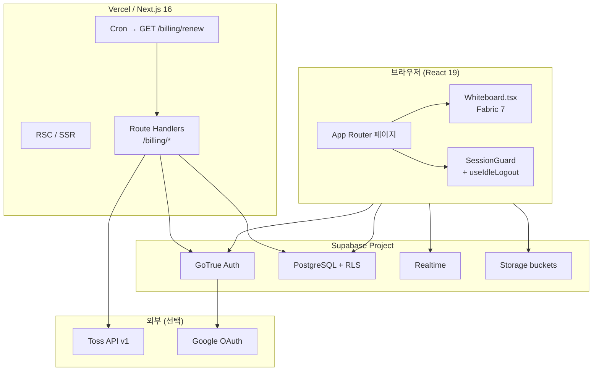

---

## 3. 앱 라우트 맵

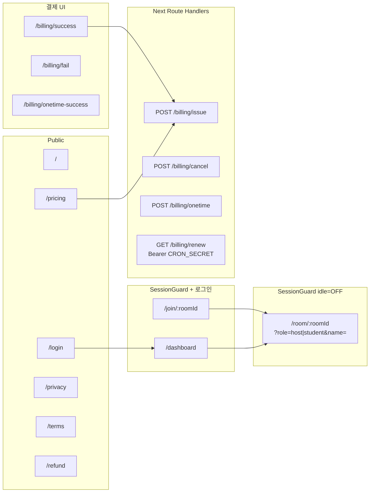

---

## 4. 인증 · 기기 세션 · 미활동 로그아웃

**관련 코드:** `lib/supabase.ts`, `lib/api/auth.ts`, `lib/deviceSession.ts`, `components/SessionGuard.tsx`, `hooks/useIdleLogout.ts`, RPC `claim_session` / `release_session`.

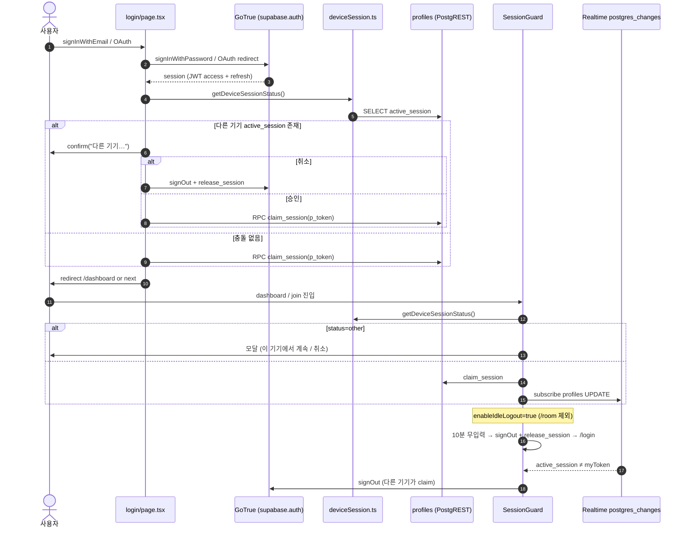

| localStorage 키 | 용도 |
|-----------------|------|
| `sb-*-auth-token` | Supabase SDK 세션 (자동 refresh) |
| `layboad_session_token` | 기기 UUID (`SESSION_TOKEN_KEY`) |
| `room_{code}_state` | 방장 UI 상태 (페이지·bgOpacity) |

---

## 5. PostgreSQL RPC & REST (전체 목록)

### 5.1 RPC (`supabase.rpc(...)`)

| RPC 이름 | 인자 | 반환 | 호출처 | 처리 요약 |
|----------|------|------|--------|-----------|
| `create_host_room` | `p_passphrase: text` | `json` (room) | `rooms.createRoom` | 6자리 code, bcrypt 암호, plan별 max_students |
| `join_room` | `p_code`, `p_passphrase` | `text` enum | `rooms.joinRoom` | rate limit, crypt 검증, room_members insert |
| `get_room_by_code` | `p_code: text` | `setof rooms` | `board.getInternalRoomId`, `rooms.verifyRoomCode` | 코드→방 1건 (SECURITY DEFINER) |
| `start_trial` | — | `timestamptz` | `rooms.createRoom` (fire-and-forget) | 30일 trial_ends_at |
| `get_host_usage` | — | `bigint` | `usage.getUsageSummary`, `canStore` | events+pages+storage 바이트 |
| `claim_session` | `p_token: text` | void | `deviceSession`, SessionGuard | profiles.active_session 덮어쓰기 |
| `release_session` | `p_token: text` | void | `auth.signOut`, idle logout | 본인 토큰일 때만 NULL |
| `redeem_gift` | `p_code: text` | `text` | dashboard | gift_codes → profiles 기간 연장 |
| `is_active_room` | `rid: uuid` | boolean | RLS 내부 | — |
| `can_access_room` | `rid: uuid` | boolean | RLS 내부 | host 또는 room_members |
| `can_read_storage_object` | bucket, name | boolean | Storage RLS | — |
| `_record_join_failure` | — | void | join_room 내부 | — |

### 5.2 PostgREST 테이블 직접 접근

| 테이블 | 연산 | 호출처 | RLS |
|--------|------|--------|-----|
| `rooms` | SELECT, DELETE | `getHostRooms`, `deleteRoom` | host_id = auth.uid() |
| `room_pages` | SELECT, UPSERT, DELETE | `getRoomPages`, `saveRoomPages` | can_access_room / host write |
| `room_events` | INSERT, SELECT | `appendEvents`, `getRoomEvents` | 방 접근자 |
| `profiles` | SELECT | `usage`, SessionGuard, billing | auth.uid() = id |
| `gift_codes` | INSERT | `/billing/onetime` (admin) | service_role |

---

## 6. 방 생성 · 입장 · 칠판 진입

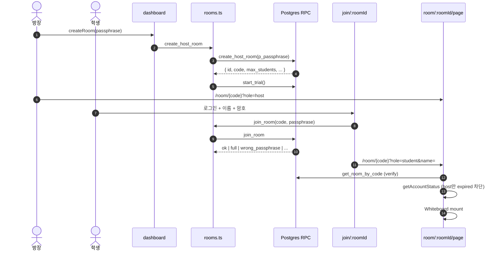

---

## 7. Whiteboard — Realtime · 저장 · Step

**채널:** `supabase.channel('room:{roomCode}')`  
**설정:** `broadcast: { self: false }`, `presence` track `{ role, name, joinedAt }`

### 7.1 Broadcast 이벤트

| event | 송신 | payload (요약) | 수신 처리 |
|-------|------|----------------|-----------|
| `draw` | 필기 완료 (path/text) | Fabric `toObject` + custom props | `applyRemoteDraw` → 방장 DB |
| `draw-live` | 그리는 중 (~50ms) | partial path | 렌더만, 저장 X |
| `erase` | 지우개/삭제 | `{ ids: string[] }` | canvas remove |
| `update-room-state` | 방장 | `RoomState` JSON | 학생 state + 수업모드 시 changePage |
| `sync-steps` | (legacy) 방장 | `{ steps, pageIndex, userName? }` | participantSteps 병합 |
| `sync-participant-steps` | 전원 | `{ pageIndex, userName, steps, activeStepId }` | pages[].participantSteps |
| `sync-bg` | 방장 | `{ bgOpacity }` | 배경 opacity |
| `sync-pages` | 방장 | `{ meta: background[] }` | PDF 메타만 (용량) |

### 7.2 영속화

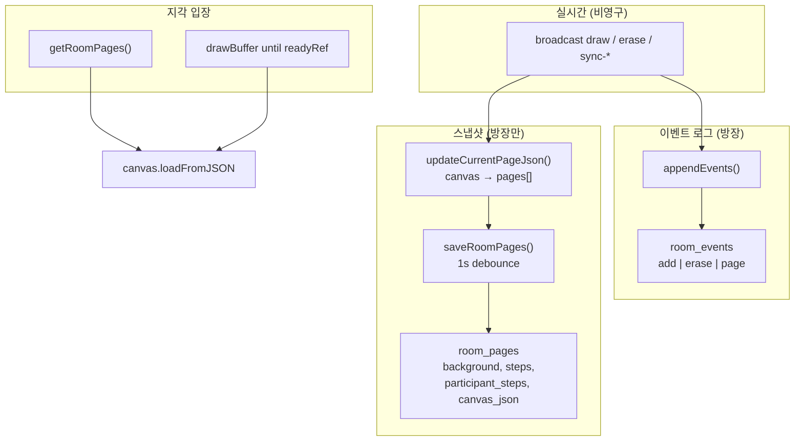

### 7.3 Step 데이터 모델 (참가자별)

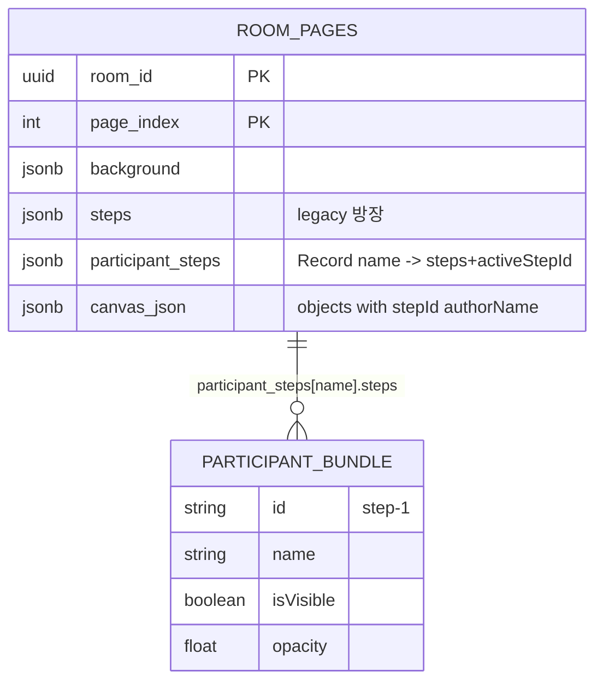

**렌더:** `Whiteboard` 렌더 엔진 — 객체 `authorName` 기준 `getParticipantBundle()` → step opacity/visibility.

---

## 8. Storage · 배경 PDF

| 버킷 | API | 함수 | 경로 규칙 |
|------|-----|------|-----------|
| `backgrounds` | Storage upload / signedUrl | `uploadFileToCloud`, `prepareBackgroundImage` | `{auth.uid()}/…` |
| `captures` | Storage upload | `uploadDataUrlToCloud` | 클립보드·캡처 |
| `replays` | Storage upload (gzip) | `archiveRoomEvents` | `{room_uuid}.json.gz` |

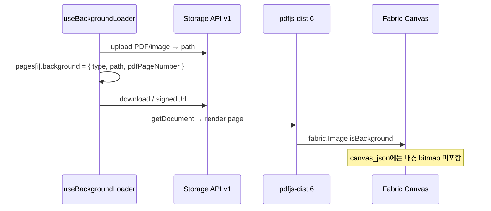

---

## 9. 결제 (Toss — 코드 존재, 운영 보류)

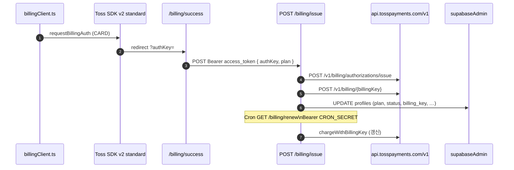

| Toss REST (v1) | 메서드 | 함수 |
|----------------|--------|------|
| `/billing/authorizations/issue` | POST | `issueBillingKey` |
| `/billing/{billingKey}` | POST | `chargeWithBillingKey` |
| `/payments/confirm` | POST | `confirmPayment` (onetime) |

---

## 10. 컴포넌트 · 훅 의존 (칠판)

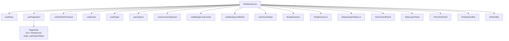

---

## 11. DB ERD (핵심)

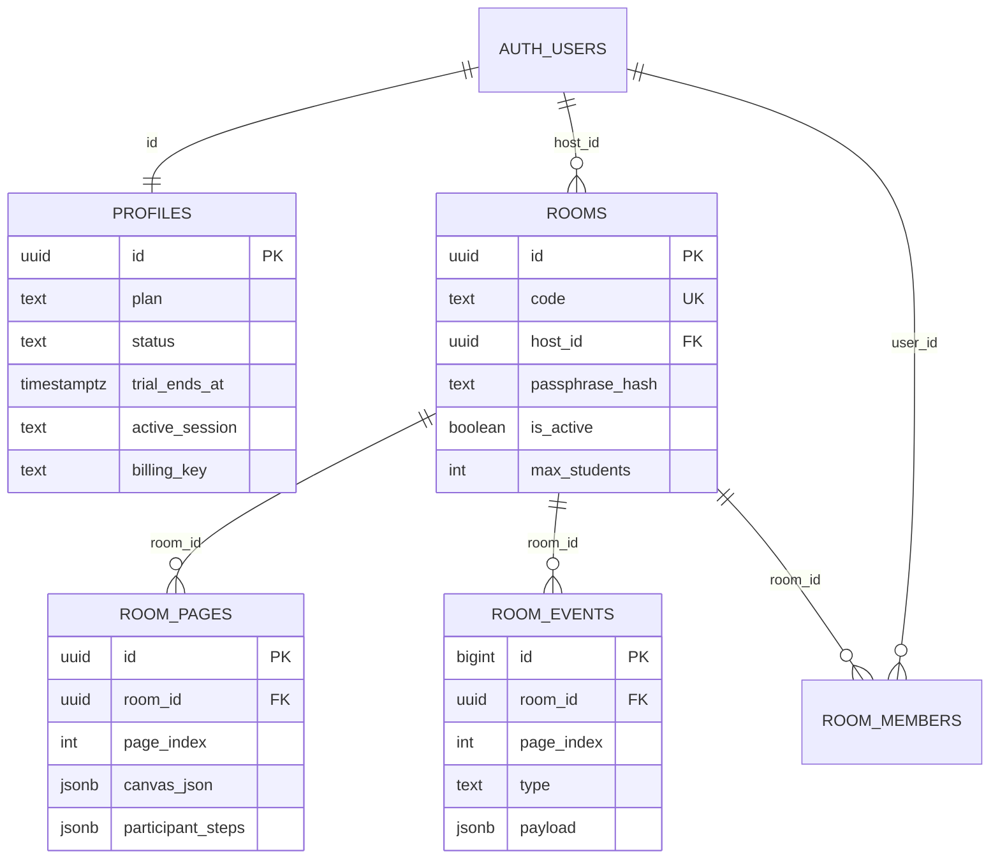

---

## 12. Auth API (클라이언트) — `lib/api/auth.ts`

| 함수 | Supabase Auth API |
|------|-------------------|
| `signUpWithEmail` | `auth.signUp({ email, password, options.emailRedirectTo })` |
| `signInWithEmail` | `auth.signInWithPassword` |
| `signInWithSocial` | `auth.signInWithOAuth({ provider: 'google' })` |
| `resendSignupVerificationEmail` | `auth.resend({ type: 'signup' })` |
| `signOut` | `release_session` RPC → `auth.signOut()` |
| `getCurrentUser` | `auth.getSession()` → `session.user` |

---

## 13. 환경 변수

| 변수 | 용도 |
|------|------|
| `NEXT_PUBLIC_SUPABASE_URL` | Supabase 프로젝트 URL |
| `NEXT_PUBLIC_SUPABASE_ANON_KEY` | 클라이언트 anon JWT |
| `SUPABASE_SERVICE_ROLE_KEY` | `supabaseAdmin` (billing) |
| `NEXT_PUBLIC_TOSS_CLIENT_KEY` | Toss JS v2 |
| `TOSS_SECRET_KEY` | Toss REST v1 Basic auth |
| `CRON_SECRET` | `/billing/renew` |
| `NEXT_PUBLIC_SITE_URL` | OAuth redirect, OG |

---

## 14. DB 마이그레이션 순서

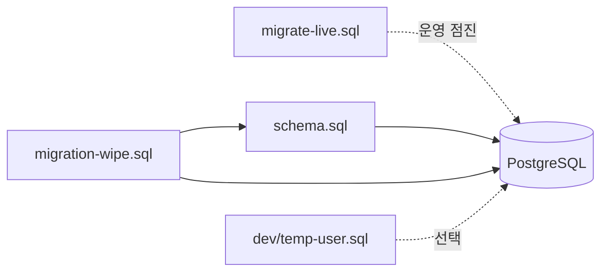

---

*문서 끝 — Mermaid는 GitHub / GitLab / 많은 Markdown 뷰어에서 렌더됩니다.*
